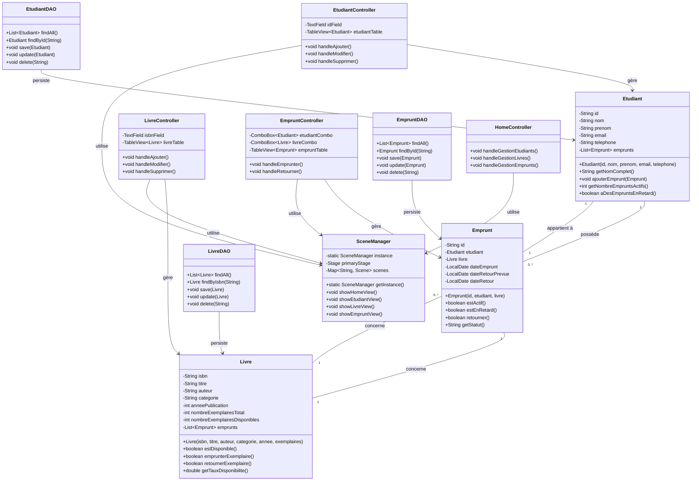
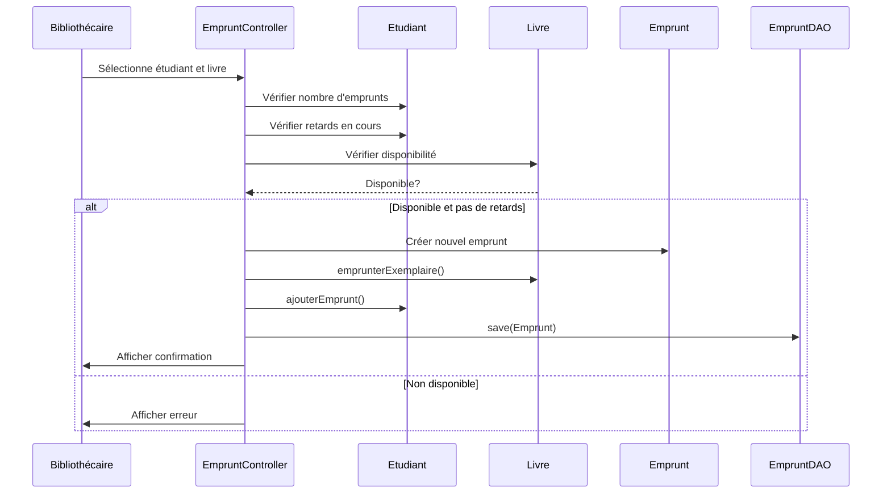
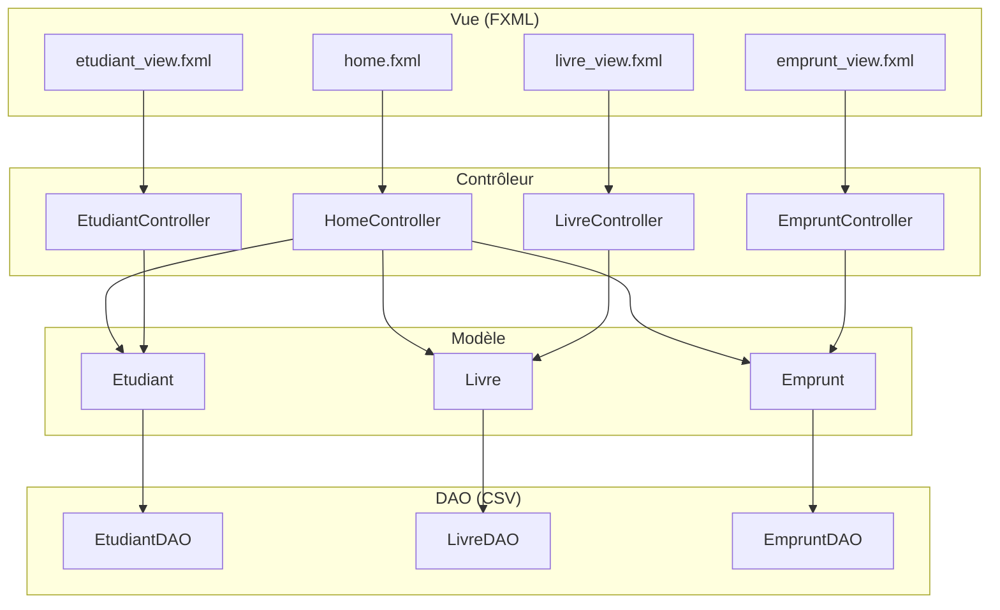

# Diagramme UML - Gestion de Bibliothèque Universitaire

## Diagramme de Classes



## Diagramme de Cas d'utilisation - Application Web

```mermaid
graph TD
    subgraph "Acteurs"
        B[Bibliothécaire]
        S[Système]
    end
    
    subgraph "Cas d'utilisation principaux"
        UC1[Gérer les étudiants]
        UC2[Gérer les livres]
        UC3[Gérer les emprunts]
        UC4[Rechercher des documents]
        UC5[Consulter le tableau de bord]
        UC6[Visualiser la base de données]
    end
    
    subgraph "Gestion des étudiants"
        UC1_1[Ajouter un étudiant]
        UC1_2[Modifier les informations d'un étudiant]
        UC1_3[Supprimer un étudiant]
        UC1_4[Consulter la liste des étudiants]
        UC1_5[Vérifier les emprunts actifs d'un étudiant]
    end
    
    subgraph "Gestion des livres"
        UC2_1[Ajouter un nouveau livre]
        UC2_2[Modifier les informations d'un livre]
        UC2_3[Supprimer un livre]
        UC2_4[Consulter l'inventaire des livres]
        UC2_5[Vérifier la disponibilité d'un livre]
        UC2_6[Mettre à jour le nombre d'exemplaires]
    end
    
    subgraph "Gestion des emprunts"
        UC3_1[Enregistrer un nouvel emprunt]
        UC3_2[Enregistrer le retour d'un livre]
        UC3_3[Consulter la liste des emprunts actifs]
        UC3_4[Identifier les emprunts en retard]
        UC3_5[Générer des rapports d'emprunts]
    end
    
    subgraph "Recherche et consultation"
        UC4_1[Rechercher par titre]
        UC4_2[Rechercher par auteur]
        UC4_3[Rechercher par ISBN]
        UC4_4[Filtrer par catégorie]
        UC4_5[Filtrer par disponibilité]
        UC4_6[Voir les détails d'un livre]
    end
    
    subgraph "Tableau de bord"
        UC5_1[Voir les statistiques générales]
        UC5_2[Consulter les emprunts récents]
        UC5_3[Voir les livres les plus populaires]
        UC5_4[Identifier les retards]
        UC5_5[Accéder aux raccourcis de gestion]
    end
    
    subgraph "Base de données"
        UC6_1[Voir toutes les données en temps réel]
        UC6_2[Exporter les données]
        UC6_3[Actualiser l'affichage]
        UC6_4[Consulter les statistiques détaillées]
    end
    
    %% Relations entre acteurs et cas d'utilisation
    B --> UC1
    B --> UC2
    B --> UC3
    B --> UC4
    B --> UC5
    B --> UC6
    
    %% Relations d'inclusion
    UC1 --> UC1_1
    UC1 --> UC1_2
    UC1 --> UC1_3
    UC1 --> UC1_4
    UC1 --> UC1_5
    
    UC2 --> UC2_1
    UC2 --> UC2_2
    UC2 --> UC2_3
    UC2 --> UC2_4
    UC2 --> UC2_5
    UC2 --> UC2_6
    
    UC3 --> UC3_1
    UC3 --> UC3_2
    UC3 --> UC3_3
    UC3 --> UC3_4
    UC3 --> UC3_5
    
    UC4 --> UC4_1
    UC4 --> UC4_2
    UC4 --> UC4_3
    UC4 --> UC4_4
    UC4 --> UC4_5
    UC4 --> UC4_6
    
    UC5 --> UC5_1
    UC5 --> UC5_2
    UC5 --> UC5_3
    UC5 --> UC5_4
    UC5 --> UC5_5
    
    UC6 --> UC6_1
    UC6 --> UC6_2
    UC6 --> UC6_3
    UC6 --> UC6_4
    
    %% Relations d'extension
    UC3_1 -.-> UC1_5 : <<extend>>
    UC3_1 -.-> UC2_5 : <<extend>>
    UC3_2 -.-> UC2_6 : <<extend>>
```

## Description Détaillée des Cas d'utilisation

### 1. Gérer les étudiants (UC1)
**Acteur principal :** Bibliothécaire
**Description :** Permet la gestion complète du fichier des étudiants

**Scénario nominal - Ajouter un étudiant (UC1_1) :**
1. Le bibliothécaire sélectionne "Ajouter un étudiant"
2. Le système affiche le formulaire de saisie
3. Le bibliothécaire remplit les champs (ID, nom, prénom, email, téléphone)
4. Le système valide les données
5. Le système enregistre l'étudiant dans la base de données
6. Le système met à jour l'affichage et confirme l'ajout

### 2. Gérer les livres (UC2)
**Acteur principal :** Bibliothécaire
**Description :** Permet la gestion complète du catalogue de livres

**Scénario nominal - Ajouter un livre (UC2_1) :**
1. Le bibliothécaire sélectionne "Ajouter un livre"
2. Le système affiche le formulaire de saisie
3. Le bibliothécaire saisit ISBN, titre, auteur, catégorie, année, exemplaires
4. Le système valide l'ISBN et les autres champs
5. Le système enregistre le livre dans la base de données
6. Le système met à jour le catalogue

### 3. Gérer les emprunts (UC3)
**Acteur principal :** Bibliothécaire
**Description :** Permet la gestion du cycle de vie des emprunts

**Scénario nominal - Enregistrer un emprunt (UC3_1) :**
1. Le bibliothécaire sélectionne "Nouvel emprunt"
2. Le système affiche la liste des étudiants et des livres disponibles
3. Le bibliothécaire sélectionne l'étudiant et le livre
4. Le système vérifie que l'étudiant n'a pas de retards
5. Le système vérifie la disponibilité du livre
6. Le bibliothécaire définit la date de retour prévue
7. Le système enregistre l'emprunt et met à jour les disponibilités
8. Le système confirme l'opération

### 4. Rechercher des documents (UC4)
**Acteur principal :** Bibliothécaire
**Description :** Permet de trouver rapidement des livres dans le catalogue

### 5. Consulter le tableau de bord (UC5)
**Acteur principal :** Bibliothécaire
**Description :** Fournit une vue synthétique de l'état de la bibliothèque

### 6. Visualiser la base de données (UC6)
**Acteur principal :** Bibliothécaire
**Description :** Permet d'accéder à toutes les données brutes du système

## Contraintes et Règles Métier

**Contraintes :**
- Un étudiant ne peut pas avoir plus de 5 emprunts simultanés
- La durée d'emprunt est limitée à 30 jours
- Un étudiant avec des retards ne peut pas emprunter
- L'ISBN doit être unique pour chaque livre

**Règles métier :**
- Les emails des étudiants doivent être valides
- Les numéros de téléphone doivent suivre le format français
- La date de retour doit être postérieure à la date d'emprunt
- Le nombre d'exemplaires disponibles ne peut pas être négatif

## Diagramme de Séquence - Emprunt de Livre



## Architecture MVC



## Flux de Données

1. **Initialisation** : Les contrôleurs chargent les données depuis les fichiers CSV via les DAO
2. **Interaction Utilisateur** : Les actions utilisateur sont capturées par les contrôleurs
3. **Traitement Métier** : Les modèles contiennent la logique métier (calculs, validations)
4. **Persistance** : Les modifications sont sauvegardées dans les fichiers CSV
5. **Mise à jour UI** : Les vues sont rafraîchies pour refléter les changements
